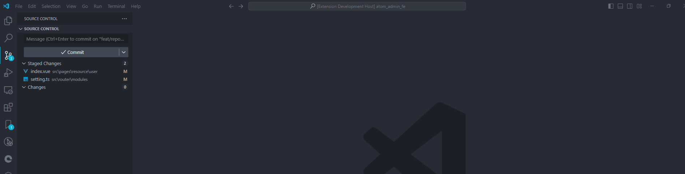
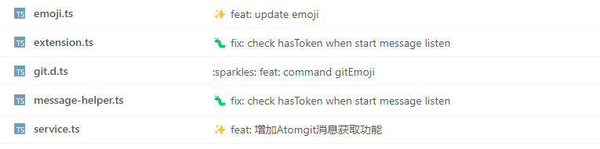
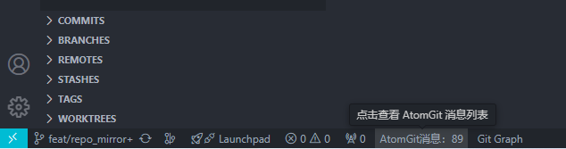
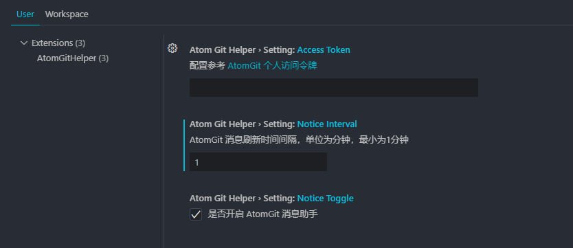

[English](./README.md) | 简体中文

# atomgit-helper 插件

## 功能介绍

atomgit-helper 是 [AtomGit](https://atomgit.com) 提供的一个 git 辅助插件，目前拥有的功能：

- [git commit emoji](#git-commit-emoji)
- [AtomGit 消息获取](#atomgit-message)

## git commit emoji

在 git commit message 中，添加 emoji，凸显此次 commit 的内容，也可用于规范提交记录：



push 到仓库后，commit 效果如下：



在 emoji 列表中，可以根据 commit type、commit 描述进行筛选，快速选中自己需要的 emoji。

目前提供的 emoji 对应的 commit types，是在 [Angular 团队提交规范](https://github.com/angular/angular/blob/22b96b9/CONTRIBUTING.md#type)的基础上，进行了一些扩展。

### 在 commit 中使用 emoji

可以按如下格式在 commit message 中使用 emoji：

```bash
<intention> [scope?][:?] <message>
```

- `intention`: An emoji from the list.
- `scope`: An optional string that adds contextual information for the scope of the change.
- `message`: A brief explanation of the change.

### 模式切换

插件提供了三种 commit emoji prefix 模式：

| 模式        | 示例    |  is Default  |
| --------   | :----:  | :----: |
| emoji      | `✨ some features` |   true    |
| shortname  | `:sparkles: some features` |   false   |
| emoji_with_type        | `✨ feat: some features` |   false   |

可在 UI 界面，按住 Alt 键，点击对应图标，进行 mode 切换，也可以在命令面板中，输入`emoji format`，进行 mode 切换。

> 命令面板呼出：
> windows 用户 ：Ctrl+Shift+P
> Mac：Command + Shift + P

## AtomGit Message

插件会定期获取 AtomGit 未读消息，在底部状态栏进行展示：



可点击状态栏，跳转至消息页面。

### 配置

你可以在插件设置中（Setting —— 搜索 AtomGitHelper），配置以下选项：

- 是否启用消息获取
- Personal Access Token：未配置 Personal Access Token 或者 scope 范围错误时，无法获取到消息状态； 具体配置可参考 [AtomGit 个人访问令牌](https://docs.atomgit.com/user/pats)

> 生成 Personal Access Token 时，作用范围(scope) 需包含 'user'

- 消息获取频率



## 下载

在 VSCode Extensions 中搜索 `atomgit-helper` 即可找到此插件。

## 开发

建议 node 版本 >= 16

- 安装全局依赖

```bash
npm install -g yo generator-code yarn
```

- 安装项目依赖

```bash
yarn install
```

- 调试：F5 启动调试

## issues

使用中遇到问题可以在[这里](https://github.com/atomgit-dev/atomgit_helper/issues)提出来。
